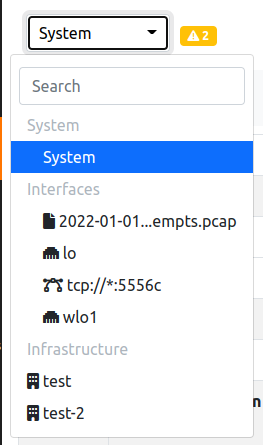

The System Interface GUI
########################

The System Interface GUI is used to monitor the status of the System on which ntopng is running.

  System Interface Dropdown

By changing interface and jumping instead to the System Interface other options are going to be available.

.. toctree::
    :maxdepth: 2

    health
    monitoring
    pools
    notifications
