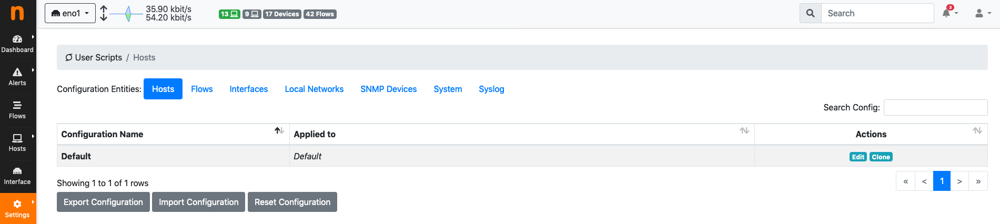
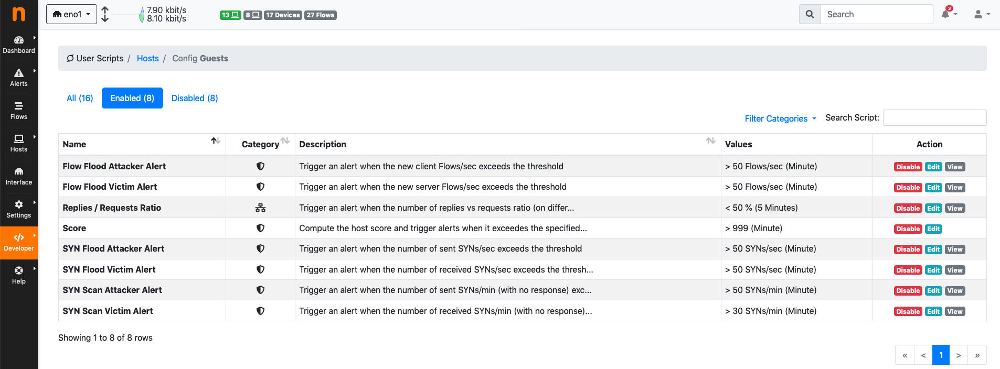

.. _WebUIUserScripts:

User Scripts
############

User scripts process network elements and perform actions such as triggering alerts. Creating user scripts is discussed in detail in :ref:`User Scripts`. This section describes how users scripts can be enabled and disabled, configured, and applied to network elements such as hosts and flows.

User scripts can be configured from any interface, from the menu `Settings->User Scripts`. 

  User Scripts Settings

Configuring a user script means:

- Choosing the network elements the script is going to be executed for.
- Enabling/disabling it.
- Setting its configuration values.

`Configurations` are used to accomplish this.

Configurations
--------------

User scripts are configured by means of `Configurations`. A `Default` configuration is always present. The `Default` configuration is used to configure:

- SNMP devices user scripts.
- Global system-wide user scripts.

The default configuration is also applied to:

- Any host of every interface.
- Any flow of every interface.
- Any interface.
- Any local network defined.

Additional configurations can be created to limit the scope of their application. This means any additional configurations can be applied to:

- Any subset of hosts of every interface.
- Any flow of a subset of the active interfaces.
- A subset of the active interfaces.
- A subset of the defined local networks.

The scope of application is shown in column `Applied To`. The Default configuration is `Applied to` any network element which is not included in any other configuration.

Creating New Configurations
~~~~~~~~~~~~~~~~~~~~~~~~~~~

New configurations can be created by `cloning` the default or any other existing configuration. To clone a configuration select the `clone` button in the `Actions` column. The cloned configuration has user scripts configurations which are equal to the configuration it has been cloned from.

A newly cloned configuration shows a message `Warning: this config is not applied to any specific target!` in the `Applied To` column. Clicking on the `edit` button in the `Actions` column allows to specify the scope of application:

- Under `Hosts`, a comma separated list of IPv4 and IPv6 CIDR prefixes can be specified to choose to which hosts the configuration is going to be applied. Hosts matching these prefixes will have this configuration applied. The longest-match principle holds. When an host matches multiple configurations, the one with the longest-match is chosen for application to the host. Prefixes are applied to hosts in any interface.
- Under `Interfaces` and `flows`, a multi-selection allows to choose to which interfaces the configuration is going to be applied.
- Under `Local Networks`,  a multi-selections allows to choose to which local networks the configuration is going to be applied.

An example of three configurations is shown in the image:

.. figure:: ../img/web_gui_user_scripts_configurations.png
  :align: center
  :alt: User Scripts Configurations

  User Scripts Configurations

In the image there are two configurations `Guests` and `IT Department`, in addition to the `Default` configuration. `Guests` is applied to all hosts matching `10.10.0.0/16`, whereas `IT Department` applies to all hosts matching `10.20.0.0/16`. Hosts not matching any of the two prefixes will have the `Default` configuration applied.

As user scripts can be controlled on a per-configuration basis:

- `Guests` can have certain user scripts enabled. The same user scripts can be disabled for `IT Department`.
- `Guests` can have certain user scripts configuration values (such as thresholds) which are different from those configured for `IT Department`.

User scripts configuration values can be controlled using button `Edit` from the `Actions` column.

Editing Configurations
~~~~~~~~~~~~~~~~~~~~~~

User scripts configurations can be edited for any of the configurable network elements. The edit page shows three tabs, namely `All`, `Enabled`, and `Disabled` to give immediate access to the whole list of user scripts, or to limit the view to only those that are enabled or disabled.

  User Scripts Configuration Edit

A user script can be enabled or disabled by clicking the corresponding button under the `Actions` column. Certain user scripts can also have their values configured. In this case, an extra button `Edit` becomes available under the `Actions` column. For example, the traffic alert user script can be edited as follows:

.. figure:: ../img/web_gui_user_scripts_configurations_edit_traffic.png
  :align: center
  :alt: User Scripts Configuration Edit Traffic Alert

  User Scripts Configuration Edit Traffic Alert

Resetting, Importing and Exporting Configurations
~~~~~~~~~~~~~~~~~~~~~~~~~~~~~~~~~~~~~~~~~~~~~~~~~

All existing configurations can be imported and exported in bulk, to ease backup, restore, and replication across multiple machines. Buttons to perform this task are available below the configuration list. Button `Export Configuration` allows to download a JSON file, whereas button `Import Configuration` accepts a previously downloaded JSON file to load the configurations. `Reset Configuration` cleans up any existing configuration on the current system.

