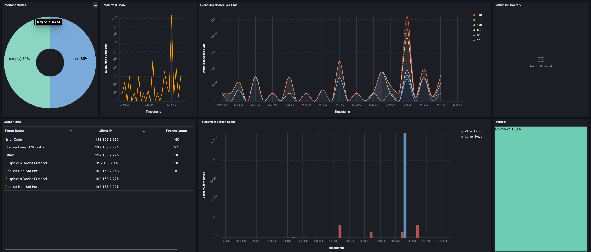
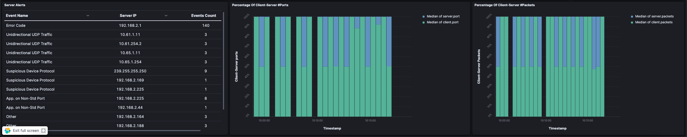

# Visualize ntopng data in Kibana

ntopng currently has the ability to export both Flows and Alerts to Elasticsearch, in 
this way users can create their own dashboards using Kibana and ELK (Elasticsearch) to have
their personalized data visualization.
In order to do this users have to export Flows to Elasticsearch and add a recipient to
export Alerts instead and have all the information they are interested in available.<br />
**_NOTE:_** Exporting Alerts to ELK needs at least a Pro License.

## Exporting Flows to ELK

In order to export Flows to ELK, users need to add the `-F` option into the configuration file.

Format:
```
  [--dump-flows|-F]=es;<mapping type>;<idx name>;<es URL>;<http auth>
```
Example:
```
  -F=es;ntopng;ntopng-%Y.%m.%d;http://localhost:9200/_bulk;
```

## Exporting Alerts to ELK

To export alerts instead, users need to configure an ELK Endpoint and then an ELK Recipient.
For more info follow the [documentation](https://www.ntop.org/guides/ntopng/alerts/available_recipients.html)<br />
**_NOTE:_**  A Pro License at least is needed to export Alerts to ELK.

## Adding ntopng data from Kibana GUI

Lastly users need to add ntopng data to Kibana GUI; in order to do it users need to add two new
index pattern to Kibana, by jumping from Kibana GUI to `Stack Management -> Index Patterns`.
Here create two new index patterns (one for the alerts, e.g. `alerts-*` and one for the flows, e.g. `ntopng-*`)
and the exported information are going to appear in the `Discover` section.

## Creating a Dashboard

In order to create a dashboar, after having followed the previous steps to have the necessary data, click on: `Dropdown Menu -> Dashboard -> Create New Dashboard`. To add a new panel click on `create visualization`. If the user wants to create a dashboard of the ntopng generated alerts just click on the alerts Index Pattern. The same mechanism works for historical flows.
After having selected the Index Pattern on the left menu the user can choose which data field to plot on the dashboard. For advanced tuning of the interface just watch the video that will be released in the coming days. To select the plot type just choose the plot of your choice in the menu.

## Interpreting The Ntop Dashboard

The dashboard provided for the ntopng-alerts was designed to give a fast overview of the current situation. In Kibana users can choose the lookback period for the historical data. 

- The `donut chart` represents the partition of the interface names to give an overivew of how many names were present
- The `orange-line plot` represents the total event score over time so that users can understand when a potential issue was present
- The `Event Risk Score` plot represents a line plot for each score value recorded by ntopng so that the user can understand which score values were more frequent and at which time
- The `Server Top Country` table is used to see which countries were more frequently recorded in the client connections and how many connections were established for each country
- The `Client Alerts` is a table used to represent which alerts (and type) were recorded for the displayed Client IP and how many alerts were generated for each IP
- The `Server Alerts` table shows the same data as the point above but for the server side IP
- The `Total Bytes: Server, Client` plots an histogram for all the bytes of the client and server so the user can understand if there is a correlation between the total score or event risk score and the traffic transmitted and if the problem is the client or the server
- The `Protocol` treemap describes which protocols were recorded by ntopng in the lookback period
- The `Percentage Of Client-Server #Ports` represent the historical partition beetween the number of client and server ports
- Lastly `Percentage Of Client-Server #Packets` is used to see the partition between the packets transmitted by the client and the server 



## Exporting An Existing Dashboard

To export a dashboard created in Kibana in the top left of the Kibana GUI `Dropdown Menu -> Stack Management -> Saved Objects` select the desired dashboard to export from the square button on the left and click `Export` on the top right, a download will start.

## Importing An Existing Dashboard

To import an existing dashboard follow the steps in previous step, and when the user is under the `Saved Objects` section, instead of exporting just click import and select the desired file on your local machine.

